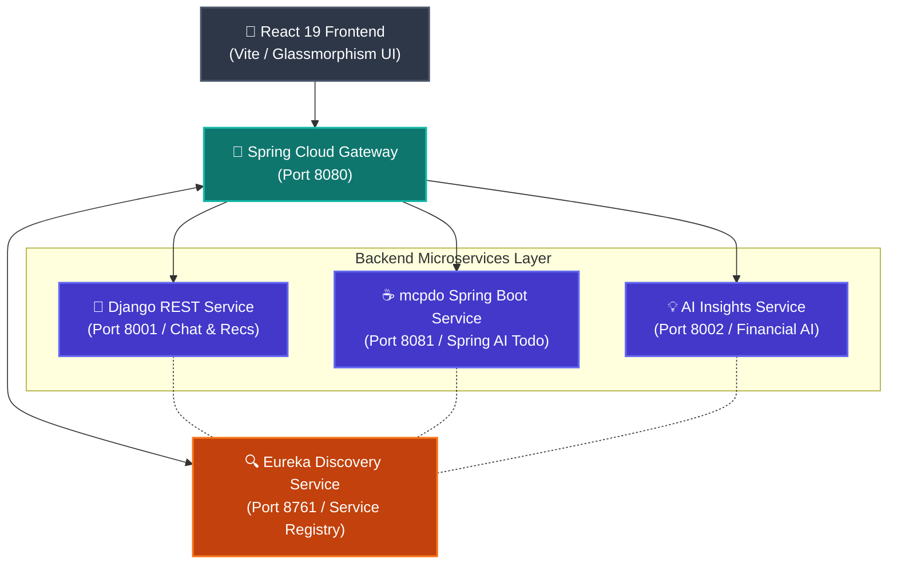
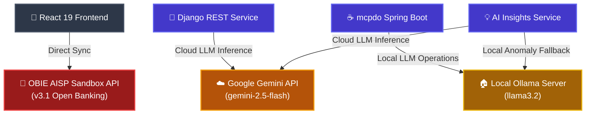

AI Financial Platform

> An intelligent, open-banking financial ecosystem powered by Google Gemini 2.5 Flash, Ollama (`llama3.2`), and distributed microservices.

this platform bridges the gap between complex banking ledgers and actionable financial decisions. Built for modern open-banking standards, Banfico pairs real-time **OBIE AISP v3.1** data with hybrid cloud/local LLM AI microservices to audit cashflow, detect spending anomalies, automate savings sweeps, and manage automated task workflows.

---

## 🛠️ Architecture & System Design

Banfico operates as a distributed microservices ecosystem routed via an API Gateway and coordinated by a service discovery registry.

### 1. High-Level Microservices Routing Architecture



### 2. Hybrid AI & External Integration Pipeline



## 🧰 Tech Stack

| Layer | Technologies / Tools |
|---|---|
| Frontend | React 19, Vite, Framer Motion, ApexCharts, Glassmorphism CSS |
| Microservices Backend | Java 21 (Spring Boot 3.x, Spring AI, Spring Cloud Gateway), Python 3.14 (Django REST Framework) |
| AI & LLMs | Google Gemini 2.5 Flash (google-genai), Ollama (llama3.2) |
| Service Mesh & Infra | Netflix Eureka Discovery Service, Docker & Docker Compose |
| Open Banking Protocols | OBIE AISP v3.1 Standards |
| Authentication & Access | Keycloak OpenID Connect (OIDC) |

## ✨ Key Features

- **Hybrid AI Engine**: Combines Google Gemini 2.5 Flash for deep financial summary tasks with a local Ollama (llama3.2) instance for local agentic task automation and private fallback analytics.
- **Smart Vault Auto-Sweeps**: Calculates real-time net surplus across checking accounts and prompts automated transfers into 4.30% APY high-yield savings vaults.
- **Financial Anomaly & Subscription Audits**: Analyzes recurring transaction streams to flag vendor price increases and unused subscription services.
- **Dynamic Timeframe Analytics**: Instant filtering across 7-Day, 30-Day, 90-Day, and YTD windows with dynamic metric recalculations.
- **Open Banking Native**: Direct compatibility with Open Banking Implementation Entity (OBIE) AISP specifications.

## 📁 Repository Structure

```
ai-finance-platform/
├── frontend/                     # React 19 + Vite UI
│   ├── src/
│   │   ├── api/                  # API Services (chatApi, recommendationApi, insightsApi, obieApi)
│   │   ├── components/           # UI Components (ChatModal, Navbar, InsightsCard)
│   │   └── pages/                # Dashboard, Spending, Transactions, Insights
├── django-chat-service/          # Django REST Framework + Gemini 2.5 Chat & Recs Microservice
├── ai-insights-service/          # Dedicated Financial Intelligence & Anomaly Detection Service
├── mcpdo-main/                   # Spring Boot + Ollama AI Automated Task Microservice
├── api-gateway/                  # Spring Cloud API Gateway (Port 8080)
├── discovery-service/            # Netflix Eureka Service Registry (Port 8761)
├── docker-compose.yml            # Container Orchestration
└── README.md
```

## 🚀 Getting Started

### Prerequisites

- **Node.js**: v18+
- **Python**: v3.10+
- **Java SDK**: OpenJDK 21
- **Ollama**: Installed locally with llama3.2 pulled (`ollama pull llama3.2`)

### 1. Run Microservices

**Django REST Service (Port 8001)**
```bash
cd django-chat-service
pip install -r requirements.txt
python manage.py migrate
python manage.py runserver 8001
```

**AI Insights Service (Port 8002)**
```bash
cd ai-insights-service
pip install -r requirements.txt # or ./mvnw spring-boot:run if configured in Java
python manage.py runserver 8002
```

**mcpdo Spring Boot Service (Port 8081)**
```bash
cd mcpdo-main
./mvnw spring-boot:run
```

### 2. Run Local LLM Server

```bash
ollama serve
ollama run llama3.2
```

### 3. Start Frontend Development Server

```bash
cd frontend
npm install
npm run dev
```

Open [http://localhost:5175](http://localhost:5175) in your browser.

## 📜 Regulatory & Disclosures

Banfico is a financial technology demonstration platform. Banking services and deposit disclosures adhere to OBIE AISP open-banking standard specifications.

## 📄 License

This project is open source and available under the MIT License.
